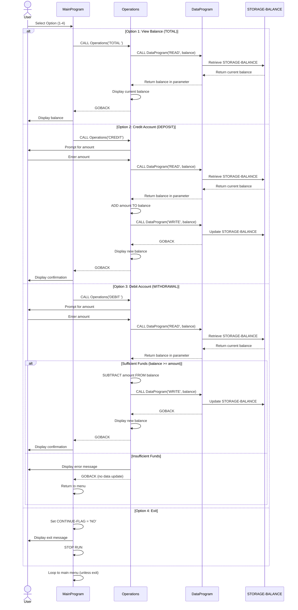

# Student Account Management System - COBOL Documentation

## Overview
The Student Account Management System is a COBOL-based application for managing student account balances. The system provides a menu-driven interface that allows users to view account balances, credit accounts with deposits, and debit accounts with withdrawals.

---

## COBOL Project Structure

### 1. **main.cob** - Primary User Interface
**Purpose:** Serves as the main entry point of the application, providing an interactive menu-driven interface for users.

**Key Functions:**
- Displays a main menu with four options: View Balance, Credit Account, Debit Account, and Exit
- Accepts user input and validates selections (must be 1-4)
- Routes user choices to the `Operations` program
- Continuously loops until user selects the Exit option
- Handles invalid input by displaying an error message

**Program Logic Flow:**
1. Display the main menu with operation choices
2. Accept numeric user input (1-4)
3. Use EVALUATE statement to route to appropriate operation:
   - Option 1 → Calls Operations with 'TOTAL ' (view balance)
   - Option 2 → Calls Operations with 'CREDIT' (deposit funds)
   - Option 3 → Calls Operations with 'DEBIT ' (withdraw funds)
   - Option 4 → Sets exit flag and terminates program

---

### 2. **operations.cob** - Business Logic Handler
**Purpose:** Implements the core business logic for account operations including balance viewing, deposits (credits), and withdrawals (debits).

**Key Functions:**
- **TOTAL/READ Operation:** Retrieves and displays the current account balance
- **CREDIT Operation:** Adds a specified amount to the account balance
- **DEBIT Operation:** Subtracts a specified amount from the account balance with overdraft protection

**Program Logic Flow:**
1. Receives operation type from MainProgram
2. Routes to appropriate operation handler:
   - **View Balance (TOTAL):** Calls DataProgram READ operation and displays current balance
   - **Credit Account:** 
     - Prompts user for credit amount
     - Calls DataProgram to read current balance
     - Adds amount to balance
     - Calls DataProgram to write updated balance
     - Displays new balance
   - **Debit Account:**
     - Prompts user for debit amount
     - Calls DataProgram to read current balance
     - **Business Rule Check:** Verifies sufficient funds exist (balance >= amount)
     - If funds available: Subtracts amount, writes new balance, displays updated balance
     - If insufficient funds: Displays error message and prevents transaction
3. Returns control to MainProgram via GOBACK

---

### 3. **data.cob** - Data Persistence Manager
**Purpose:** Manages persistent storage and retrieval of student account balance data.

**Key Functions:**
- **READ Operation:** Retrieves the stored account balance
- **WRITE Operation:** Updates and stores the account balance

**Program Logic Flow:**
1. Receives operation type and balance parameter
2. Routes to operation handler:
   - **READ:** Transfers stored balance (STORAGE-BALANCE) to the calling program's balance variable
   - **WRITE:** Updates stored balance (STORAGE-BALANCE) with the new balance value
3. Returns control to calling program via GOBACK

---

## Business Rules for Student Accounts

### Account Balance Management
- **Initial Balance:** All student accounts are initialized with a balance of 1,000.00
- **Balance Format:** Stored and processed as 6-digit integer with 2 decimal places (COBOL format: 9(6)V99)

### Credit Operations (Deposits)
- Students can deposit funds at any time
- Credit amount is added directly to the current balance
- No maximum balance limit is enforced
- Transactions must be positive amounts

### Debit Operations (Withdrawals)
- Students may withdraw funds only if sufficient balance exists
- **Overdraft Protection:** System prevents any withdrawal that would result in a negative balance
- If requested debit amount exceeds available balance, the withdrawal is rejected with an error message
- Transaction remains incomplete if funds are insufficient

### Data Integrity
- The system maintains a single persistent storage location (STORAGE-BALANCE in data.cob)
- All operations read from and write to this central data store
- READ operations retrieve the current stored balance
- WRITE operations update the persistent balance after validation

### Transaction Flow
1. All balance modifications follow a read-validate-write pattern
2. Debit operations include a validation check before commitment
3. Emergency exits do not involve data writes, preserving account integrity

---

## Technical Notes

### Program Linkage
- **MainProgram** → Calls `Operations` program with operation type parameter
- **Operations** → Calls `DataProgram` with operation type and balance parameter
- **DataProgram** → Manages persistent storage (no external calls)

### Data Types Used
- `OPERATION-TYPE / PASSED-OPERATION`: 6-character field (padded with spaces for alignment)
- `BALANCE / STORAGE-BALANCE`: Numeric field with 2 decimal places (9(6)V99)
- `USER-CHOICE`: Single digit numeric for menu selection
- `CONTINUE-FLAG`: 3-character text field ('YES' or 'NO')

### Error Handling
- Invalid menu selections display an error message and re-prompt the user
- Insufficient funds errors prevent debit operations and display appropriate messages
- No validation for credit amounts (assumed user input is valid)

---

## Usage Example

```
User starts program → Views main menu
User selects "1. View Balance" → Current balance displayed (e.g., $1,000.00)
User selects "2. Credit Account" → Prompted for amount → Balance increases
User selects "3. Debit Account" → Prompted for amount → If sufficient funds: balance decreases; else: error
User selects "4. Exit" → Program terminates
```

---

## System Architecture - Data Flow Diagram


